# 作业2实验报告：基于低秩分解的图像修复

## 摘要

本次作业实现了 Robust PCA（RPCA）的 Inexact ALM 求解器，尝试用"低秩 + 稀疏分解"的思路来修复被污染的图像

核心想法很简单：一张干净图片的主要信息可以用一个低秩矩阵 L 来表示，而上面的噪声、遮挡只占很少的像素，用稀疏矩阵 S 表示，两者加起来就是观测到的图 A = L + S

我在两种底图（人像和合成纹理）上分别叠了三种不同的破坏（文字遮挡、缺块、椒盐噪声），形成一个 2×3 的实验网格来全面测试 RPCA 的表现。此外还复现了两篇 Optional 论文的方法（RSLRT 和 TILT），做了一个交互式网页来展示结果

## 1. 问题分析与数学建模

### 1.1 直觉

做这个作业之前我对"低秩分解能修复图像"这件事是半信半疑的，毕竟文字、缺块这种东西看起来怎么也不像"低秩"。但仔细想了一下：一张 160×160 的灰度图本质上是一个 160×160 的矩阵，如果图片内容比较规整（比如纯色渐变、重复纹理），那这个矩阵的秩其实很低，可能只有几位数。而文字、划痕、椒盐噪点虽然视觉上很显眼，但它们只影响了很少的像素位置，所以是"稀疏"的

这就给了我们一个直觉：能不能把 A 拆成 L + S，其中 L 是干净的（低秩），S 是脏东西（稀疏）

直接这么做有个问题——"最小化 rank(L)"和"最小化非零元素个数"都是 NP-hard 的。作业里讲的松弛方法很巧妙：把 rank 换成核范数（奇异值之和），把 ℓ0 换成 ℓ1，问题就变成了一个凸优化：

`min ||L||_* + λ ||S||_1,  s.t.  A = L + S`

这里的 λ 控制的是"多大程度的异常算稀疏"，λ 太小的话，很多噪声会被放过；λ 太大，干净的图像内容也会被当成异常删掉

### 1.2 Inexact ALM 求解器

参考了 Lin, Chen & Ma (2010) 的论文，用 Inexact ALM（非精确增广拉格朗日乘子法）来求解。核心思路是对约束 A = L + S 构造拉格朗日函数，然后交替更新 L 和 S：

- **L 的更新**：化简后变成一个奇异值阈值（SVT）操作，对矩阵做 SVD，把小的奇异值砍掉
- **S 的更新**：化简后变成一个软阈值操作，绝对值小于 τ 的元素直接置零
- **乘子更新**：Y ← Y + μ(A - L - S)，同时 μ 按 ρ 倍增长（但不超过上限 μ_bar）

```text
输入: A, λ, ε
初始化: L0 = 0, S0 = 0
       Y0 = A / max(||A||2, ||A||∞ / λ), μ0 = 1.25 / ||A||2
重复:
  L(k+1) = SVT[1/μk](A - Sk + Yk/μk)
  S(k+1) = Shrink[λ/μk](A - L(k+1) + Yk/μk)
  Z(k+1) = A - L(k+1) - S(k+1)
  Y(k+1) = Yk + μk Z(k+1)
  μ(k+1) = min(ρ μk, μ_bar)
直到 ||Z(k+1)||F / ||A||F < ε
```

实现上，我只调用了 `numpy.linalg.svd` 来算 SVD（这个算 RPCA 的基础操作，手写没意义），其余的迭代逻辑、阈值操作、停止准则都是自己写的

## 2. 实验设置

### 2.1 数据构造

一开始我只做了 3 个场景（人像+文字、纹理+缺块、人像+椒盐），但后来觉得不太严谨——不同方法跑的是不同的底图，没法公平对比。所以我改成了 2 种底图 × 3 种破坏类型的完整网格：

- **人像底图**：把 `grace_hopper.jpg` 缩放到 160×160 灰度图后做 rank-6 截断。之所以要截断，是因为原图不满足低秩假设，rank-6 以后的信息都是高频细节，对 RPCA 来说相当于噪声
- **纹理底图**：用 4 组平滑基函数的外积来构造一个 rank-4 的渐变纹理。这张图天然低秩，是检验 RPCA 理论假设的理想测试样例
- **三种破坏**：(1) 叠加文字/划痕作为遮挡；(2) 挖掉一个矩形块模拟局部缺失；(3) 加 10% 椒盐噪声

### 2.2 评价指标

| 指标 | 含义 |
| --- | --- |
| PSNR | 恢复图和干净图之间的峰值信噪比，越高越好 |
| SSIM | 结构相似性，越接近 1 越好 |
| Relative Error | \|\|L-L_gt\|\|_F / \|\|L_gt\|\|_F，相对 Frobenius 误差 |
| Support F1 | RPCA 找到的稀疏位置和真实破坏位置的重合度 |

### 2.3 参数设置

统一停止阈值 1e-6，最大迭代 250 次。λ 的选取我用的是 `λ = c / sqrt(max(m,n))`，其中 c 需要根据场景手动调。最终各场景的 c 值见后表

## 3. 结果展示与分析

### 3.1 双底图统一对比

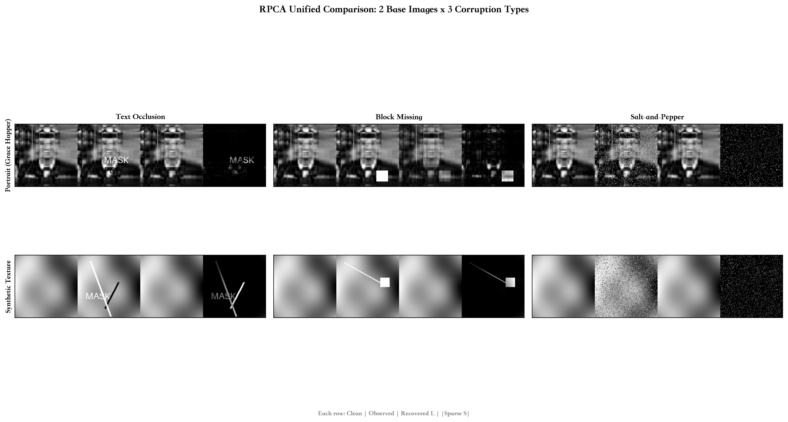

上图是我最想展示的结果——2×3 的完整网格。每格从左到右是：干净图、观测图、RPCA 恢复的低秩项 L、分离出的稀疏异常 |S|

| 场景 | 方法 | PSNR(dB) | SSIM | Relative Error | Support F1 |
| --- | --- | --- | --- | --- | --- |
| 人像文字遮挡 | RPCA | 29.90 | 0.9810 | 0.0844 | 0.5603 |
| 人像缺块修复 | RPCA | 19.72 | 0.8405 | 0.2703 | 0.0769 |
| 人像椒盐噪声 | RPCA | 54.50 | 0.9995 | 0.0086 | 0.8183 |
| 人像椒盐噪声 | Median(3x3) | 30.72 | 0.9400 | 0.0762 | - |
| 纹理文字遮挡 | RPCA | 43.48 | 0.9985 | 0.0111 | 0.6210 |
| 纹理缺块修复 | RPCA | 42.24 | 0.9977 | 0.0128 | 0.5906 |
| 纹理椒盐噪声 | RPCA | inf | 1.0000 | 0.0000 | 1.0000 |
| 纹理椒盐噪声 | Median(3x3) | 48.41 | 0.9950 | 0.0063 | - |

**几个有意思的观察：**

1. **纹理底图全面碾压人像底图**。这个结果一开始让我有点意外，但想了一下就合理了——纹理图是我用数学公式构造的，严格 rank-4，完美满足 RPCA 的低秩假设；而人像图只是 rank-6 截断，截掉的高频信息在 RPCA 看来和噪声差不多，会被分到 S 里去，所以恢复质量天花板就低一些

2. **椒盐噪声最好去，缺块最难修**。椒盐噪声是典型的稀疏异常（只有 10% 的像素被替换），而且每个噪点是孤立的，不破坏周围像素的结构，所以 RPCA 处理起来很轻松——纹理椒盐甚至达到了 PSNR=inf（恢复结果和原图在浮点精度内完全一样）。但缺块不一样，一块 28×30 的连续区域被替换成一个常数，这破坏的不只是像素值，还有整个区域的秩结构，所以恢复效果差很多

3. **RPCA 远强于中值滤波去椒盐**。人像椒盐场景下 RPCA 的 PSNR 是 54.50 dB，而 3×3 中值滤波只有 30.72 dB。因为中值滤波本质是局部平滑，会模糊边缘；而 RPCA 是全局地把噪点"剥离"到稀疏项里，完全不碰干净的像素。但有意思的是，在纹理椒盐场景下中值滤波也有 48.41 dB，说明对非常规则的图像，简单的局部方法也能做得不错

### 3.2 主实验详情

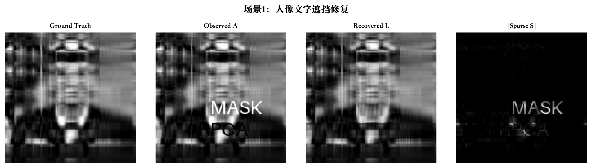

人像文字遮挡的 SSIM 达到了 0.98，肉眼看恢复图和原图几乎没差别。仔细看 sparse 图，"MASK" 和 "RPCA" 这几个字被完整地提取了出来，说明 RPCA 确实在做"分离"而不是"模糊"

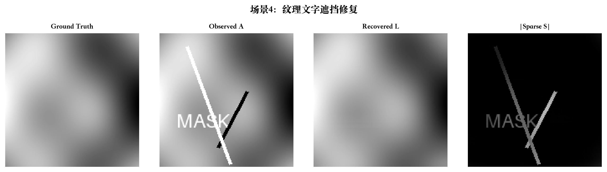

纹理底图上的文字遮挡更容易修复——PSNR 从 29.90 直接跳到 43.48 dB。因为在严格低秩的图上，文字几乎不引入额外的秩，分解更干净

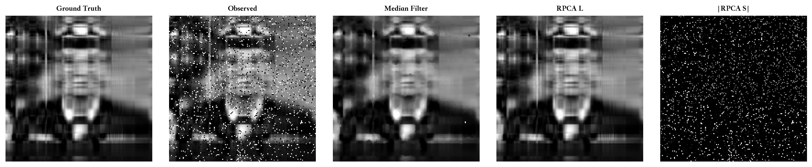

这张对比图很直观：中值滤波的结果虽然去掉了大部分噪点，但整个人像边缘变得模糊；RPCA 的结果则非常锐利，和原图几乎一样

### 3.3 λ 敏感性与收敛性

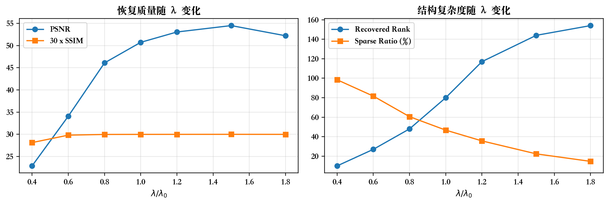

在人像椒盐场景上做了 λ 的扫描（c 从 0.4 到 1.8）。结果很有规律：c 太小（0.4）的时候 PSNR 很低，因为 λ 小意味着允许更多东西进稀疏项，导致图像主体被错误地"吸"走；c 从 0.4 到 1.5 PSNR 持续上升；但 c=1.8 时又回落了——λ 太大意味着稀疏项被压缩得太狠，部分噪声留在了低秩项里。这个实验让我真正理解了 λ 的物理含义

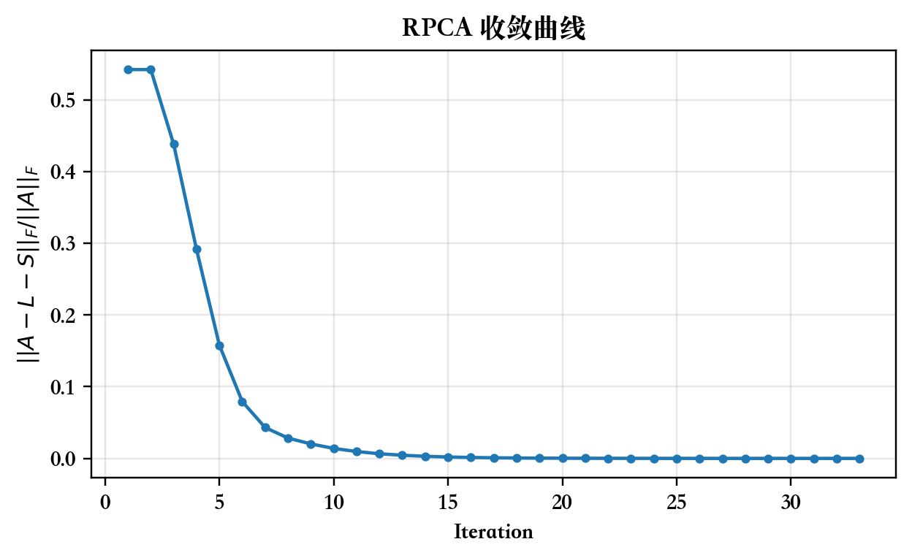

Inexact ALM 收敛得很快，三十多次迭代就收敛了。一开始我以为要跑几百次迭代，结果发现 μ 的指数增长策略（每次乘以 ρ=1.5）让收敛速度非常快。

### 3.4 加分实验

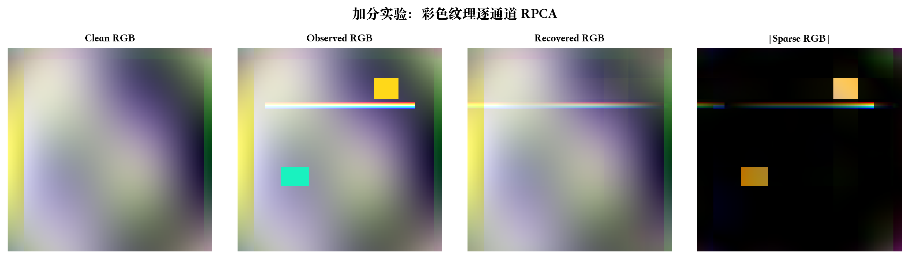

我尝试了最简单的彩色扩展——对 R、G、B 三个通道分别做 RPCA。平均 PSNR=29.37 dB，效果还行但不是最优的（更好的做法是把 RGB 拼成一个大矩阵做联合分解）。不过作为 proof of concept 够了

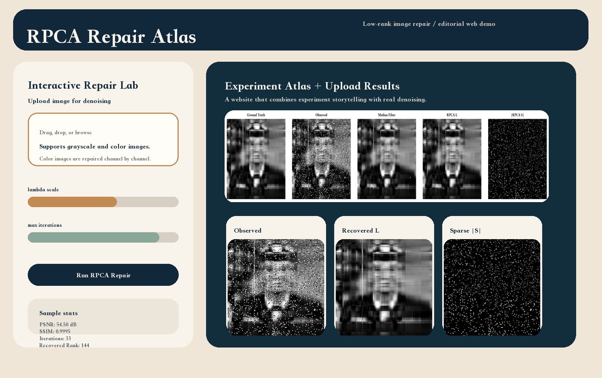

我搭了一个交互式网页来展示结果。网站用 Python 标准库 `http.server` 做后端提供 API 和静态文件服务，原生 HTML/CSS/JS 做前端。网站上展示了全部 6 个实验的结果和指标，包括 2×3 统一对比网格、可拖动滑块的观测图/恢复图对比、稀疏异常项可视化、9 张分析图表、Optional 实验结果和完整的指标汇总表。本地运行 `python webapp.py` 时还支持上传图片实时跑 RPCA 调参。网站同时部署为纯静态版本到 GitHub Pages，方便在线浏览

### 3.5 Optional (2): Repairing Sparse Low-rank Texture

这篇论文的想法比基础 RPCA 多了一层：规则纹理不仅在图像空间中是低秩的，在 DCT（离散余弦变换）域中也是稀疏的。所以模型里多了一个 W = DCT(X) 的稀疏约束：

`min ||A||_* + λ||W||_1 + α||E||_1,  s.t. A = X, W = DCT(X), P_Ω(X + E) = P_Ω(D)`

| 方法 | PSNR(dB) | SSIM | Relative Error | 备注 |
| --- | --- | --- | --- | --- |
| Sparse Low-rank Texture | 19.00 | 0.8912 | 0.1926 | 低秩 + DCT 稀疏双先验 |
| RPCA 基线 | 16.35 | 0.8327 | 0.2614 | 仅低秩 + 稀疏分解 |

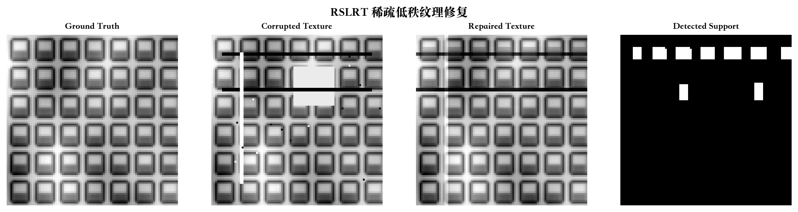

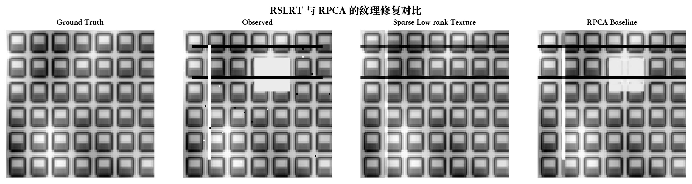

加了 DCT 稀疏先验后 PSNR 提升了约 2.65 dB。从图上看，RSLRT 恢复的窗格纹理边界更完整、更干净，大块缺失区域的填充也更自然。不过说实话这个方法的调参挺头疼的（λ、α、support quantile 都要调），而且 support refinement 的步数太多会导致过拟合

### 3.6 Optional (3): TILT

TILT 解决的是一个 RPCA 不太好处理的问题：如果纹理本身发生了几何畸变（比如拍摄角度歪了），那先做校正再做低秩分解会更好。TILT 把这两步放到一个框架里：

`min ||L||_* + λ||E||_1,  s.t. I o τ + JΔτ = L + E`

外层循环估计仿射/投影变换参数，内层 ALM 更新低秩和稀疏项

| 模式 | PSNR(dB) | SSIM | Relative Error | 变换矩阵误差 |
| --- | --- | --- | --- | --- |
| TILT-Affine | 19.54 | 0.9175 | 0.1676 | 0.0027 |
| TILT-Projective | 19.74 | 0.9209 | 0.1638 | 0.0061 |

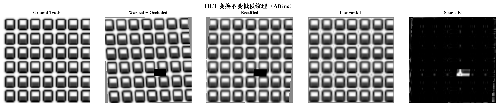

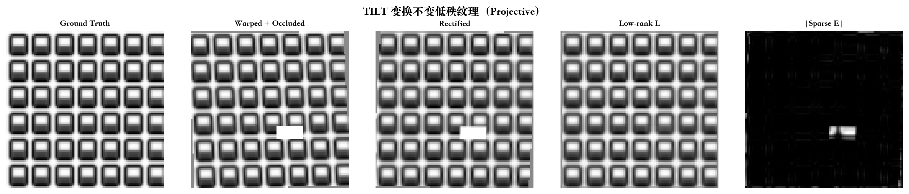

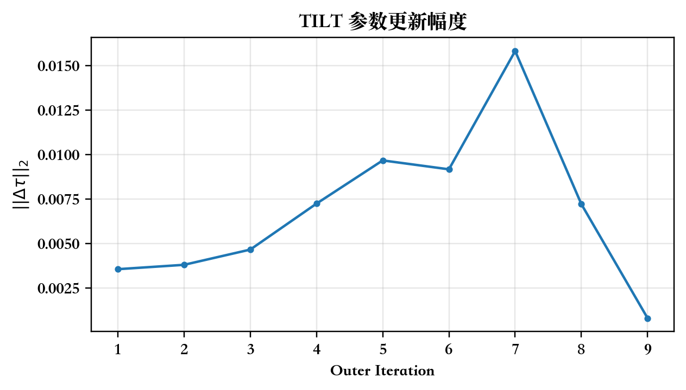

变换矩阵误差只有 0.0027/0.0061，说明估计的几何变换和真实值非常接近。不过 TILT 对初始化比较敏感——如果初始变换参数离真值太远，容易收敛到局部最优。我用了金字塔策略（先在低分辨率上粗调，再在高分辨率上精调）来缓解这个问题

## 4. 遇到的问题与反思

### 4.1 人像底图不满足低秩假设

这是我踩的第一个坑。一开始我直接用 grace_hopper 的灰度图做 RPCA，结果发现恢复出来的图非常模糊，PSNR 也不高。debug 了半天，最后发现原因很简单——原图的秩远高于 6，不满足 RPCA 的基本假设。对秩为 r 的图像做 RPCA，模型假设可以用一个低秩矩阵完美表示它，但原图的秩可能有几十上百，那些"多出来"的高频细节（边缘、纹理）会被 RPCA 当成稀疏异常给删掉

**解决方案**：先对原图做 rank-6 的 SVD 截断，人为创造一个低秩干净图作为 ground truth。截断后图像会稍微变模糊，但结构信息完整保留，RPCA 的理论假设也成立了

**反思**： RPCA 不是万能的，它的效果高度依赖"干净图确实是低秩的"这个假设。真实照片几乎不可能严格满足这个条件，所以实际应用中需要先用其他方法（比如压缩感知、自编码器）降维，再做 RPCA

### 4.2 λ 的选择很痛苦

论文里给的默认值是 λ = 1/sqrt(max(m,n))，但我实际跑的时候发现这个值在大多数场景下都不太好。比如文字遮挡场景，默认 λ 会让稀疏项里混入太多正常图像内容，导致恢复出来的图有明显的"空洞"

我最后是对每个场景都做了 λ 的扫描（在椒盐场景上画了那张敏感性曲线），手动选了看起来最好的 c 值。这个做法有点"调参侠"，不太优雅，但在课程作业的范围内足够了。如果时间更多，可以考虑用交叉验证或者基于噪声估计的自适应 λ

### 4.3 缺块修复的效果不如预期

人像缺块修复的 PSNR 只有 19.72 dB，是我所有场景里最差的。一开始我以为是 λ 没调好，扫了一遍发现 c=0.3 已经是局部最优了——问题出在缺块本身的性质上：一个 28×30 的连续区域被一个常数替换，这不是简单的"稀疏"扰动。它既破坏了图像的像素值，也破坏了矩阵的秩结构。RPCA 假设稀疏项只影响少量独立的位置，但缺块是一个连通区域，和这个假设矛盾

**反思**：这也解释了为什么论文里的 image inpainting 方法（比如 Total Variation inpainting）通常不会用简单的 RPCA——它们需要利用图像的局部连续性，而 RPCA 是一个全局方法

### 4.4 TILT 和 RSLRT 不能直接套在人像上

一开始我想让所有方法都跑同一张图，方便横向对比。但实现的时候发现 RSLRT 依赖 DCT 稀疏先验（适合规则重复纹理），TILT 依赖低秩纹理的几何校正（同样需要重复结构）。硬套到人像上只会得到很差的结果，反而让人误以为方法不行


## 5. 结论

通过这次作业，我对 Robust PCA 有了比较完整的理解。核心收获：

1. RPCA 的效果高度依赖"低秩假设"——对严格低秩的合成纹理效果极好（PSNR 可以到 inf），对近似低秩的真实图像则效果受限
2. 不同类型的"稀疏破坏"难度差异很大：离散的椒盐噪声最容易处理，连续的缺块最难。
3. λ 的选择对结果影响很大，需要根据场景特点手动调参
4. RPCA 是一个全局方法，不考虑像素间的空间关系。对于需要保持局部连续性的任务（比如 inpainting），需要结合其他方法
5. RSLRT 和 TILT 都是在 RPCA 基础上引入额外的结构先验（DCT 稀疏性和几何不变性），在它们各自的适用场景下确实能提升恢复质量


